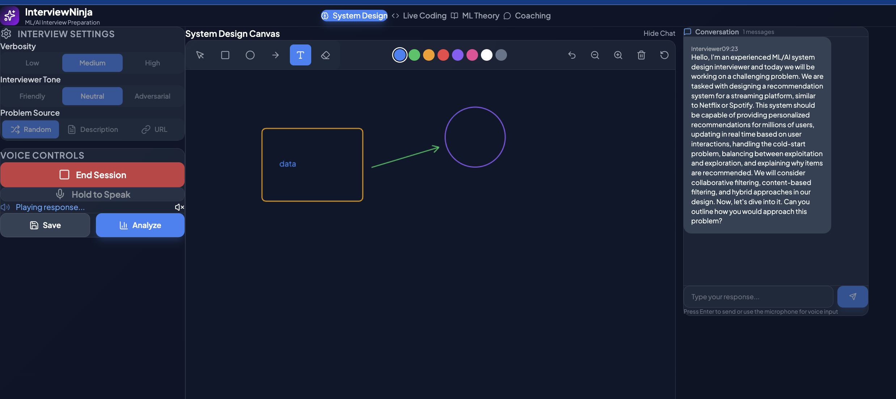

# Cursor 2-Day AI Hackathon


---

# InterviewNinja

> AI-powered voice agent that helps ML/AI professionals practice technical interviews through realistic simulations

## Tech Stack

- **Frontend**: React 18, Vite, TailwindCSS, Monaco Editor, KaTeX
- **Backend**: Python, FastAPI, Uvicorn
- **AI/ML**: OpenAI GPT-4 (conversation & analysis), Eleven Labs (text-to-speech)
- **Code Execution**: Piston API
- **Other**: Web Speech API (speech recognition), HTML5 Canvas

## How to Run

```bash
# Clone the repo
git clone https://github.com/elena-kalinina/InterviewNinja.git
cd InterviewNinja

# Backend setup
cd backend
python -m venv venv
source venv/bin/activate  # On Windows: venv\Scripts\activate
pip install -r requirements.txt

# Set up environment variables
cp .env.example .env
# Add your API keys to .env:
# OPENAI_API_KEY=your_openai_key
# ELEVENLABS_API_KEY=your_elevenlabs_key

# Run the backend
uvicorn app.main:app --reload

# Frontend setup (new terminal)
cd frontend
npm install
npm run dev
```

Open http://localhost:5173 in your browser.

## Details

### Features

- **4 Interview Types**: System Design, Live Coding, ML Theory, Career Coaching
- **Voice Interaction**: Speak naturally with the AI interviewer using your microphone
- **Realistic TTS**: Natural-sounding interviewer voice powered by Eleven Labs
- **Customizable Settings**: Adjust verbosity (low/medium/high) and tone (friendly/neutral/adversarial)
- **Problem Sources**: Random problems, custom descriptions, or scrape from URLs
- **Live Coding**: Write and execute code with Monaco Editor
- **Drawing Canvas**: Sketch system design diagrams with shapes, arrows, and text
- **Formula Rendering**: LaTeX formula support for ML theory discussions
- **Session Analysis**: Get AI-powered feedback on your interview performance

### Architecture

```
┌─────────────────┐     ┌─────────────────┐     ┌─────────────────┐
│                 │     │                 │     │                 │
│  React Frontend │────▶│  FastAPI Backend│────▶│  OpenAI GPT-4   │
│                 │     │                 │     │                 │
└─────────────────┘     └─────────────────┘     └─────────────────┘
        │                       │                       
        │                       ▼                       
        │               ┌─────────────────┐            
        │               │                 │            
        └──────────────▶│  Eleven Labs    │            
                        │  (TTS)          │            
                        └─────────────────┘            
```

### Screenshots



### Future Plans

- Response streaming for faster perceived latency
- Session history and replay
- More interview problem sources
- Mobile-responsive design
